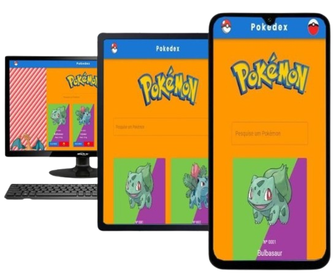

# API do Pokemon

<div align="center">
    
</div>

>Seja bem-vindo à aplicação web do Pokemon, a plataforma interativa onde você pode explorar os detalhes dos Pokémon de forma dinâmica e visualmente atraente, criada com foco na experiência do usuário!

## Sobre o Projeto
- Pokedex é uma aplicação que reúne funcionalidades como:
    - `Listagem de Pokémon`: Explore uma lista dinâmica com os Pokémon mais famosos.
    - `Detalhes do Pokémon`: Veja informações detalhadas como peso, habilidades, tipos e experiência.
    - `Busca interativa`: Encontre Pokémon rapidamente com a funcionalidade de pesquisa.
    - `Design dinâmico`: Cores e estilos que representam os tipos dos Pokémon, proporcionando uma experiência imersiva.

<h3 align="center">Além disso você irá encontrar:</h3>

- `Animações`: Cards animados ao carregar a página para uma experiência fluida.

- `Design Responsivo`: Adaptado para Mobile, Tablet e Desktops.

<div align="center">
    
</div>
<div align="center">
    <h3>Veja o deploy desta aplicação no seguinte link:</h3>
    <a href="https://poke-api-peach-xi.vercel.app/">Projeto PokeAPI</a>
</div>

### Tecnologias usadas no projeto

<div> 
     
     
     
     
     
     
     
     
</div>

## Como Rodar o Projeto

1. Clone o repositório:

```bash
git clone https://github.com/JohannPDaniel/PokeAPI.git
```
2. Navegue até a pasta do projeto:

```bash
cd pokeAPI
```
3. Instale as dependências:
```bash
npm install
```
4. Crie o arquivo `.env` na raiz do projeto:
```bash
/node_modules
/public
/src
.env
```
5. Dentro do arquivo `.env`, coloque a url da API do Pokemon:
```bash
VITE_API_BASE_URL=https://pokeapi.co/api/v2
```
6. Inicie o servidor de desenvolvimento:

```bash
npm run dev
```
7. Abra o navegador e acesse:
```bash
http://localhost:5173
```

## Contate me

<a href="https://wa.me/5519991069456">
    
</a>
<a href="https://www.linkedin.com/in/johann-patr%C3%ADcio-daniel-112425196/">
    
</a>
